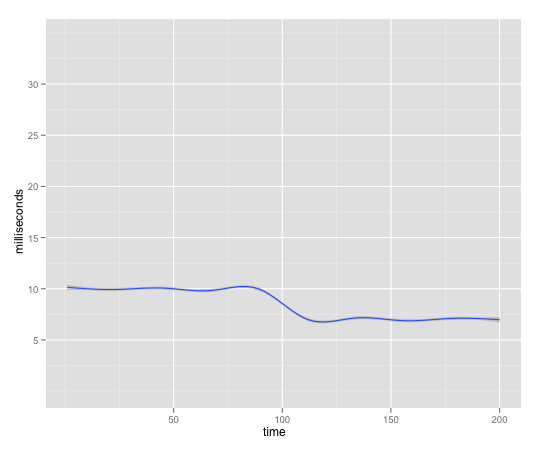
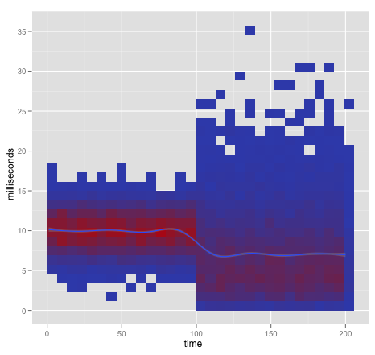
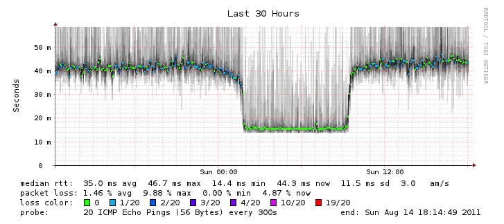

Thoughts On Load Testing
========================

This was written by [Adam Fletcher](https://twitter.com/adamfblahblah)
([www.thesimplelogic.com](http://www.thesimplelogic.com))

One task that often falls on the lonely sysadmin is load testing. In this
article I'm going to talk about some philosophies and processes I used when
doing load tasting in my past roles.

I'm going to focus on testing the server side. There's a lot of articles on how to 
optimize the client side experience, and it is very important that you are aware of both
the client side and server side tuning changes so that you can give the customer the best 
experience. 

Use Science 
-----------

(credit to XKCD. [Buy the shirt!](http://store.xkcd.com/xkcd/#StandBackScience))

What I mean by that is that load testing is really experimentation. You're
testing a hypothesis: Is setup A better than setup B?  Develop your hypothesis,
experiment, and measurements, and make conclusions based on data, not feelings.
Don't forget that you need to control as many variables as possible. Don't test
on your VMs, or your staging server that the customer is also using.

Have Defined Targets 
---------------------

You can't determine if your architecture scales/is fast enough/can handle
traffic during a disaster/won't crash when you launch/etc. without have
something measurable that determines success. For example, instead of saying
"make each page load in 400 milliseconds", it is better to say something like
"Every page load must have also resources loaded within an average 400
milliseconds with a standard deviation of 25 milliseconds with 1000 clients
performing actions every x seconds on y series of pages."  You will then know
when you are done load testing because all the measurements you are taking show
you have achieved success.

Scale First
-----------

If the y axis is latency and the x axis is number of workers, then scaling is
keeping y constant while you increase x to infinity.  This is much harder
than keeping the number of workers constant and lowering latency. The first
thing to look at during load testing is the shape of your latency curve as load
increases. Keep that curve flat and you're most of the way there.

Understand Your Traffic
-----------------------

If you're already suffering a load problem in production, great! Track the
pages being requested and the path of the requests through your system. Use a
tool like Google Analytics to get a picture of the diversity of the pages hit
and the flow your users take through the product. You'll want to be able to
model those flows in your load generation software.

For example, an online store may have a few different paths users commonly take
through the system: arrive at the home page organically, search for a product,
add to a cart, and check out; arrive at a special landing page for a sale, add
to cart, checkout; arrive at the home page organically and use the customer
services features; etc. If you viewed this store's traffic at single point in
time you could divide your simultaneous traffic up by percentage of pages hit:
at a point in time, 30% of the requests are to /search, 20% are to /checkout,
40% are to /, and finally 10% are to /customer-service. This is the model you
should use for load generation. 

Your traffic also follows patterns that depend on the time of day. With the
advent of (somewhat) elastic capacity allocation, you can model these usage
patterns and adjust your capacity to fit the pattens of usage. 

Furthermore, you need to be aware of client side changes such as allowing your
users to use HTTP pipelining or inlining Javascript versus loading the
Javascript in another HTTP request. Making the server scale requires you
understanding the client. 

Know Your Resource Limits
-------------------------

You don't have infinite computing power. You don't have infinite money. Most
importantly, you don't have infinite time. Be smart about how you use that
time.  

It's expensive to have people do all the load testing science we're talking
about in this article. With a little thought you can probably guess where your
bottleneck is (and I'm going to guess it is something related to your data
storage). Use your systems knowledge to make your first hypothesis "If I remove
the obvious bottleneck, the system will be faster".

Also, to paraphrase Artur Bergman, don't be a backwards idiot - 
[buy some SSDs](http://www.livestream.com/oreillyconfs/video?clipId=pla_3beec3a2-54f5-4a19-8aaf-35a839b6ecaa).
They are expensive per GB but they are dead cheap per IOP/S. They're also
cheaper than the time you are spending doing the load testing. You'll want to 
use these SSDs in the machines that have the highest IO load (and you know which
means those are, because you're measuring IO load, right?).

Graphs Lie
----------

There was an excellent talk at Velocity this year about the dangers of trusting
your graphs given by John Rauser entitled [Look at Your Data](http://www.youtube.com/watch?v=coNDCIMH8bk). 
He pointed out that you have
to be careful of the trap of representing many points of data at the same X
as the mean of those points of data as this representation hides the distribution of that data. 
This most commonly occurs when measuring
latency and during load testing, when you have many requests at time X that,
when averaged, come to Z milliseconds. Plot Z for many Xs and you miss the
distribution of the latencies at X. 

John's video explains it better, but if you look at this graph:

You'd think from this graph that everything is great - your latency went down!

But if we look at the distribution of our data at each sampling point:

We see that some of users are having a really bad experience on our site. 

A good example of a tool that doesn't have this problem is [Smokeping](http://oss.oetiker.ch/smokeping/). 
Here's an example of Smokeping telling me that my home internet connection has some jitter in latency:

I've also put a 
gist up with the R code used to generate the graphs above [here](https://gist.github.com/1043012).

Measure Time and Resources Spent in Each Component
--------------------------------------------------

If you aren't instrumenting each piece of software in your stack you should 
start doing so. Instrument the entry point to your software and the exit point
and graph this data over time. Combine this with even simple data from sar or *stat
you can learn a lot about your code without ever firing up a profiler. 

Learn And Use The Right Tools
-----------------------------

Good tools will allow you to export the raw data in such a way that you can
then do analysis on it.  Tools that expose your system resource consumption
metrics are critical, and it probably doesn't matter what you use as long as
you storing and graphing roughly what iostat, sar, vmstat, netstat and top give
you you'll be good. Learn what each metric really means - do you know why your
software is context switching 4000 a second? Do you know if that is bad (hint:
probably)? How would that manifest itself in top?

Learn to use the profiler that comes with your product's implementation
language.  Profilers are amazing things. If you can't use a language-specific
profiler try a system-wide profiler such as oprofile or similar. 

When you have all this data, use a real data analysis tool to look at it. Learn
some R or NumPy/SciPy. Instead of using Excel or a clone for data analysis, 
consider learning a numerical computing language such as R. 
For example, in R or NumPy you can write a script that takes all of your raw
resource consumption data (CPU, RAM, IOPS, etc) and runs correlation tests
against the latency data. Try to do that in Excel. Oh, you can then use that
script in your monitoring. 

People often call load testing an art, but all that really means is that
they're not doing science. Load testing can be challenging but hopefully
this article has given you some things to think about to make your load
testing easier and more effective. 
