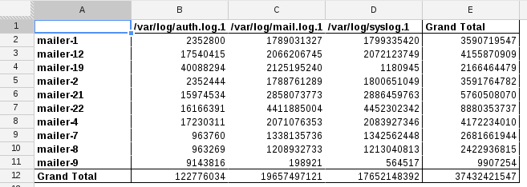
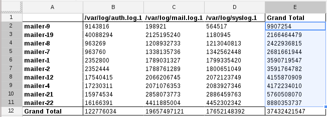
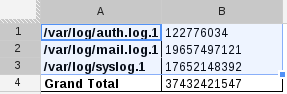

# Easy Visualizations with Google Spreadsheets

On the [8th day of the first
sysadvent](http://sysadvent.blogspot.com/2008/12/day-8-one-off-graphs.html), I
talked about ways to get graphs from arbitrary data. I was never really satisfied
with the result since I find gnuplot to be a bit cumbersome (though it is
powerful).

Since then, technology and tools have improved greatly. For one, Google's got
some pretty neat features in their Google Spreadsheets product.  Bonus, it's
free to use and if your company already uses Google Apps, you've got an easy
way to share data and spreadsheets easily among coworkers. 

So why care? Well, the spreadsheets product has some excellent statistical and
visual tools.

Let's dive in, but first we need to gather data!

## Mail server activity

There are a bunch of mail servers at work. Let's look at yesterday's log file
sizes and compare them in a spreadsheet (sounds exciting, I know!)

```
(
  echo "host\tfile\tsize"
  for i in server1 server2 server3 server4 ... ; do 
    ssh $i du -sb /var/log/{mail.log,auth.log,syslog}.1 \
    | awk '{ OFS="\t"; print "'$i'", $2, $1}
  done
) /tmp/maildata.tsv
```

The output is tab-delimited and is hostname, logfile, size-in-bytes. In general,
most spreadsheet tools can import data that is comma or tab-separated quite
easily. My data looks like this:

```
host  file  size
mailer-1  /var/log/mail.log.1 1789031327
mailer-1  /var/log/auth.log.1 2352800
mailer-1  /var/log/syslog.1 1799335420
mailer-12 /var/log/mail.log.1 2066206745
...
```

## Import CSV

Loading this into a spreadsheet is easy. In Google Spreadsheets, `File ->
Import` will let you do it.

Once imported, I get a nice spreadsheet with three columns:


Each line in your file becomes a row in the spreadsheet.

## Pivot Tables

Pivot tables let you group and aggregate data.

Select all the data in your spreadsheet, then create a pivot table with the
`Data -> Pivot table report` menu.

### Which server has the largest total logs?

On the right, you'll see "Report Editor" where you can add rows, columns, and
values to your pivot table. 

To see which server has the largest total logs: 

* click 'Rows - Add field' and choose the 'host'
* click 'Columns - Add field' and choose 'file'
* click 'Values - Add Field' and choose 'size'

At the end of each column and row will be a 'Grand Total' entry which
summarizes the whole column or row.



Since I'm looking for 'largest total logs', for the 'Group by: host' panel on
the right, choose 'Sort by -> SUM of size in...' 'Grand Total' - which results
in this nicely sorted display:



### Which log is largest across all servers?

Create a new pivot table, but this time specify 'file' as the rows, don't add
any columns, and specify 'size' for the values. The result is a table showing
total sum by each log file:



## Visualization

You can create graphs from 
