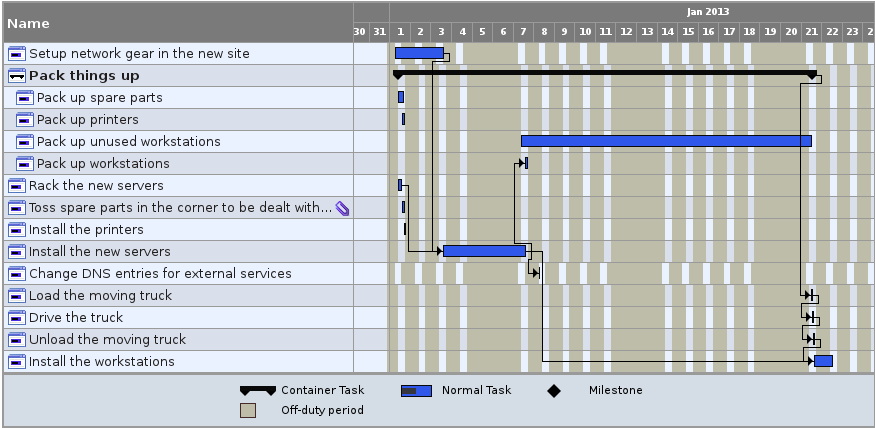
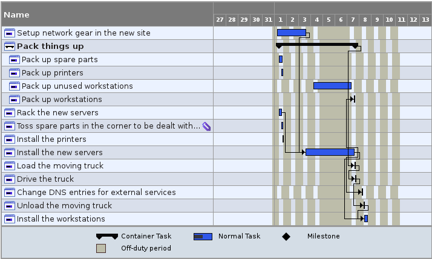
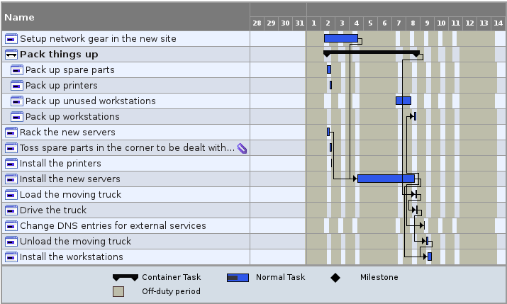
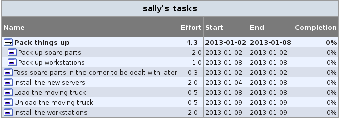

Scheduling projects with TaskJuggler
====================================

"Ew! Project management?" you say, "that does nothing but get in my way!" But
let's face it, most sysadmins don't have a project manager to work with, so they
end up being __de facto__ project managers. If you're doing anything beyond
daily tasks, you manage projects, whether or not you think of it that way.
"Project management for sysadmins" could be a whole book, but for today we'll
just consider scheduling. You can try to put together a project schedule
yourself, or you can let the computer do that for you. The open source tool
[TaskJuggler](http://www.taskjuggler.org/) is well-suited for this task.

Unlike other project management tools, TaskJuggler is largely text-based (as of
this writing, there is no GUI for version 3). Output is generated with a command
line program. This lends it well to working with tools like make, vi, and
version control systems. 

To get started, install TaskJuggler. Some Linux distributions have a package in
the repository, but if your preferred platform (including Windows and Mac OS X)
doesn't, you can install it from source or from ruby gems. More information on
installation can be found on the
[TaskJuggler download page](http://www.taskjuggler.org/download.html). Note that
the example used here is done with TaskJugger 3.3.0.

The example we explore today is that of a site move. Sysadvent, Inc. has
outgrown its current building and will be moving to a new, shiny tower downtown.
Sally Sysadmin is in charge of this project. The move will begin in January and
is expected to take three months to complete.

Fortunately, Sally doesn't have to do all the work herself. She has two helpdesk
staff, Harry Helpdesk and Henrietta Helpdesk (no relation!), and a network
engineer who works from 5 AM until 1 PM, Norbert Network. In addition, the CEO has said that Sally can use Iggy
Intern for four hours a week.

Sally gets her TaskJuggler file started:

    project sysadvent "Sysadvent, Inc. Move" 2013-01-01 +3m {
        timezone "America/New_York"
    }

    # People: our greatest asset
    resource sally "Sally Sysadmin" { }
    resource harry "Harry Helpdesk" { }
    resource henrietta "Henrietta Helpdesk" { }
    resource norbert "Norbert Network" {
        workinghours mon-fri 05:00-13:00
    }
    resource iggy "Iggy Intern" {
        # Leave some time for Iggy to get Jordan's coffee
        limits { weeklymax 4h }
    }

The project block defines attributes of the overall project. In this case the
name, as well as a descriptive title, the start and end dates, and the time
zone. Each person is defined with a resource element. Resources can have
properties, for example the scheduling limit we set for Iggy or Norbert's
unusual hours.

Now that the resources have been defined, Sally lays out the tasks that will
need to be completed. She's careful to note the effort that each task will
require and any dependencies that might exist. Sally also took advantage of this
opportunity to buy new servers for the company.

    task new_network "Setup network gear in the new site" {
        allocate norbert
        effort 3d
    }
    task pack "Pack things up" {
        task unused_workstations "Pack up unused workstations" {
            allocate iggy
            effort 8h
        }
        task spare_parts "Pack up spare parts" {
            allocate harry, henrietta, sally
            effort 2d
        }
        task printers "Pack up printers" {
        allocate iggy { alternative harry, henrietta }
            effort 2h
        }
        task workstations "Pack up workstations" {
            allocate sally, harry, henrietta, iggy
            depends !!install_new_servers
            effort 1d
        }
    }
    task rack_new_servers "Rack the new servers" {
        allocate iggy { alternative sally }
        effort 4h
    }
    task install_new_servers "Install the new servers" {
        allocate sally
        effort 2d
        depends new_network, rack_new_servers
    }
    task change_dns "Change DNS entries for external services" {
        allocate norbert
        effort 1h
        depends install_new_servers
    }
    task load_truck "Load the moving truck" {
        depends pack
        allocate sally, harry, henrietta, iggy
        effort 4h
    }
    task drive_truck "Drive the truck" {
        depends load_truck
        duration 1h
    }
    task unload_truck "Unload the moving truck" {
        depends drive_truck
        allocate sally, harry, henrietta, iggy
        effort 4h
    }
    task install_workstations "Install the workstations" {
        depends unload_truck, install_new_servers
        allocate sally, harry, henrietta, iggy
        effort 2d
    }
    task install_printers "Install the printers" {
        allocate harry, henrietta
        effort 2h
    }
    task put_away_spare_parts "Toss spare parts in the corner to be dealt with later" {
        allocate harry, henrietta, sally
        effort 2h
    }

Tasks have an ID and a name. In order to schedule a task, TaskJuggler needs to
know a start and and end date. These can either be explicitly given, or
determined based on duration/effort and task dependencies. It's important to
note the difference between effort, which is the amount of *person-time* it takes
to complete a task, and duration, which is a wall time measure. A task which has
effort defined must have one or more resources allocated. Although Iggy *really*
wants to drive the moving truck, Sally thinks it's better to let the moving
company do that, so she gave that task a duration. 

Tasks can depend on one or more other tasks. The depends line refers to tasks in
one of two ways: absolutely or relatively. Absolute paths start with the
outermost task and contain the IDs of all intermediate tasks joined with
periods. For example: `pack.printers`. Absolute paths use bangs to indicate how
far up the tree to go. For example: to get to `load_truck` from `pack`, you
would use `!load_truck`, but to get to `load_truck` from `pack.printers`, you
would use `!!load_truck`.

Now that the project is well-defined, Sally wants to see the schedule. To do
this, she defines a report.

    # Make a Gantt chart
    taskreport gantt "gantt_chart" {
        columns name, resources, start, end, chart { scale day }
        loadunit days
        formats html
    }

Now Sally is all ready to schedule the project. She has already created a
directory called "moving" in her web server's space, and she'll generate the
HTML output there:

    tj3 sysadvent.tjp -o /var/www/html/moving

Here's her schedule, simplified for easier blog viewing.

Pleased with her work, Sally shows the boss. "That's nice," he says, "but I
don't want to have to wait forever for Iggy to box up the unused workstations.
Have Norbert help, but I don't want them working on it more than 6 hours per 
day." Sally goes back and adds `norbert` to the allocation for 
pack.unused_workstations and adds an additional line to that task:

    limits { dailymax 6h }

This shortened the length of the project considerably.

Sally presented the schedule to the rest of the team. Everyone was excited until
Harry mentioned that he would be on vacation January 3-7. Oh! And the 1st is a
holiday, and in this universe, the IT staff only ever work during normal
business hours. First, Sally adds the holiday into the project. She inserts the
following line above the resource definitions:

    leaves holiday "New Year" 2013-01-01

Then she adds Harry's vacation to his resource definition:

    resource harry "Harry Helpdesk" {
	    vacation 2013-01-03 - 2013-01-07
    } 

Finally, the project is scheduled.

Everyone's happy with the schedule now, but it can be easy to overlook tasks.
Sally decides to make a report for each person showing the tasks assigned to
them. In order to be most efficient, she first creates a macro for the staff
report:

    # Generate reports for staff members
    macro Staff_Report [
        taskreport "${1}" {
        headline "${1}'s tasks"
        columns name, effort, start, end, complete
        formats html
        hidetask ~(isdutyof(${1},plan) )
        }
    ]

Now she can generate a report for each staff member, showing only the tasks they
are assigned to.

    ${Staff_Report "sally"}
    ${Staff_Report "harry"}
    ${Staff_Report "henrietta"}
    ${Staff_Report "norbert"}
    ${Staff_Report "iggy"}

As the project went along, Sally occasionally re-ran her project. She liked to
see the completion bars grow. Because Sally is a perfect estimator, TaskJuggler
was safe in assuming that everything was being completed exactly on time.

This example presented only a small portion of what TaskJuggler can do. On the
scheduling side, you can create multiple scenarios. TaskJuggler can keep track
of leave information, track costs, even send and process timesheets.  For more
information, see the [TaskJuggler website](http://www.taskjuggler.org). The
final example taskjuggler file is available at
<http://www.funnelfiasco.com/sysadvent/2012>.
